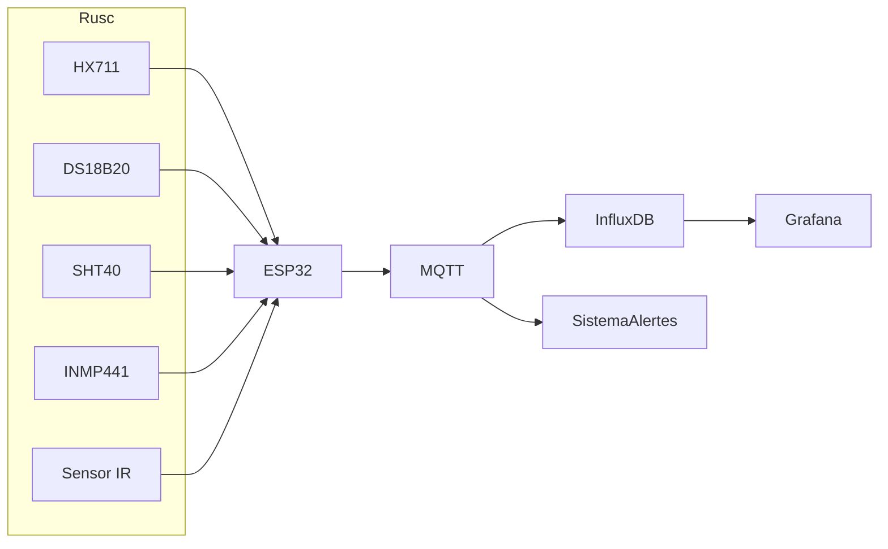

<p align="center">
  
</p>

# 🐝 Ruscs Intel·ligents

# Ruscs Intel·ligents

Sistema IoT per al monitoratge de ruscs mitjançant **ESP32** i sensors de pes, temperatura, humitat, so i activitat. El projecte permet recopilar dades en temps real, detectar anomalies, generar alertes i visualitzar la informació mitjançant **MQTT**, **InfluxDB** i **Grafana**.

> **Estat del projecte**
>
> Aquest és un projecte en desenvolupament continu orientat al monitoratge intel·ligent de ruscs. El seu objectiu és proporcionar una plataforma oberta per recopilar, analitzar i visualitzar dades de les colònies d'abelles. Les funcionalitats i els mètodes d'anàlisi s'aniran ampliant progressivament a partir de les dades obtingudes tant en simulació com en entorns reals.

---

# Finalitat

Aquest projecte neix amb la voluntat de combinar **Internet de les Coses (IoT)**, **programació** i **apicultura** per facilitar el seguiment de l'estat dels ruscs de manera contínua i no invasiva.

A més del monitoratge en temps real, la plataforma està pensada per generar un conjunt de dades que pugui servir de base per a futurs estudis sobre el comportament de les colònies, la detecció primerenca d'anomalies i el desenvolupament de noves eines d'anàlisi dins l'àmbit de l'apicultura de precisió.

---

# Objectius

- Monitorar contínuament l'estat del rusc.
- Mesurar:
  - Pes
  - Temperatura interior i exterior
  - Humitat
  - So ambiental
  - Activitat de les abelles
- Detectar possibles anomalies:
  - Enjambrament
  - Robatori
  - Atac de vespa asiàtica
  - Malalties
- Enviar dades mitjançant MQTT.
- Emmagatzemar dades a InfluxDB.
- Visualitzar-les amb Grafana.
- Facilitar una arquitectura modular, escalable i replicable.

---

# Arquitectura del sistema



---

# Components

## Hardware

- ESP32
- HX711
- DS18B20
- SHT40
- INMP441
- Sensor IR
- INA219
- Panell solar
- Bateria LiPo
- TP4056

## Software

- Python
- MQTT (Mosquitto)
- InfluxDB
- Grafana

---

# Estructura del projecte

```
ruscs-intel-ligents/
│
├── README.md
├── LICENSE
├── requirements.txt
│
├── simulate.py
├── dashboard.py
│
├── src/
│   ├── main.py
│   ├── alerts.py
│   └── config_example.yaml
│
└── docs/
    ├── hardware.md
    ├── wiring.md
    ├── software-architecture.md
    ├── data-flow.md
    ├── simulation.md
    └── dashboard.md
```

---

# Instal·lació

Clona el repositori:

```bash
git clone https://github.com/NataliaBioResearch/ruscs-intel-ligents.git

cd ruscs-intel-ligents
```

Instal·la les dependències:

```bash
pip install -r requirements.txt
```

---

# Quickstart

## 1. Executar el simulador

El simulador genera dades realistes del rusc sense necessitat de maquinari.

Inclou:

- cicles circadians
- estacionalitat
- correlacions entre sensors
- variacions meteorològiques
- esdeveniments especials
- anomalies simulades

```bash
python simulate.py
```

Més informació:

```
docs/simulation.md
```

---

## 2. Executar el dashboard

Visualització en temps real de:

- Pes del rusc
- Temperatura interior i exterior
- Humitat
- Activitat
- Nivell de so
- Consum elèctric
- Alertes
- Esdeveniments

```bash
python dashboard.py
```

Més informació:

```
docs/dashboard.md
```

---

# Funcionament

El flux de dades del sistema és el següent:

```
Sensors
     │
     ▼
 ESP32 o Simulador
     │
     ▼
 MQTT Broker
     │
     ▼
 InfluxDB
     │
     ▼
 Grafana
```

Durant el desenvolupament, el simulador substitueix l'ESP32 i genera dades sintètiques compatibles amb la resta del sistema, facilitant les proves sense necessitat de disposar del maquinari.

---

# Documentació

La documentació del projecte es troba a la carpeta **docs/**:

- hardware.md
- wiring.md
- software-architecture.md
- data-flow.md
- simulation.md
- dashboard.md

---

# Línies futures

Aquest projecte està pensat per continuar evolucionant. Algunes de les línies de desenvolupament previstes són:

- Integració completa amb sensors físics.
- Millora dels algoritmes de detecció d'anomalies.
- Predicció d'enjambrament mitjançant intel·ligència artificial.
- Classificació d'esdeveniments acústics.
- Integració de dades meteorològiques.
- Comparació de múltiples ruscs.
- API REST per a la consulta de dades.
- Aplicació web.
- Aplicació mòbil.
- Exportació i anàlisi de dades per a estudis científics.

---

# Llicència

Aquest projecte es distribueix sota la llicència **MIT**.

Consulta el fitxer **LICENSE** per a més informació.
